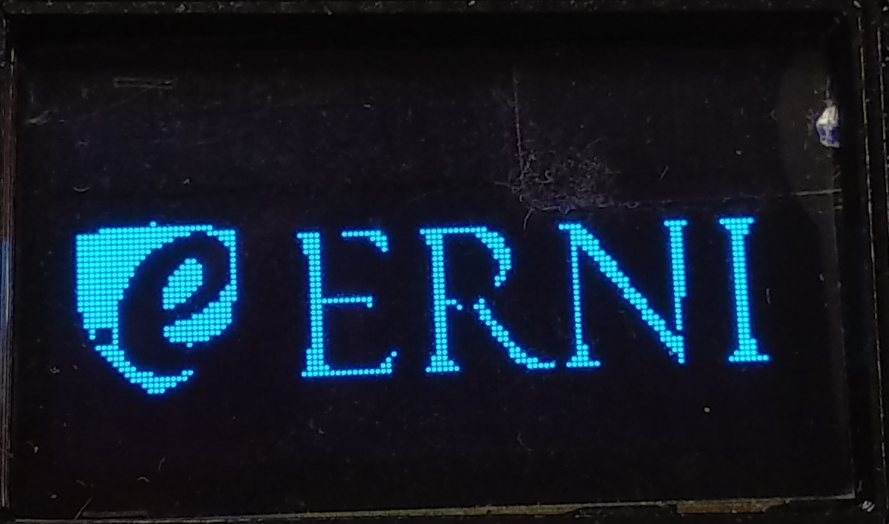
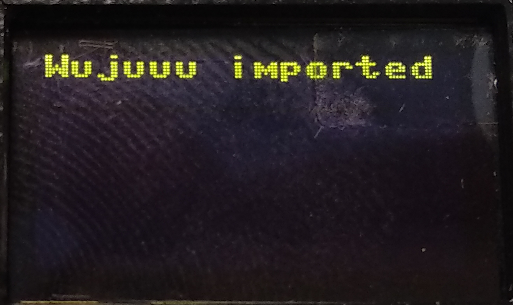

# MicroScriptConsole

This converts your ESP8266 board into a console where you can execute all script on the board. It will look all the `.py` files on the filesystem except for the `boot.py`, `main.py` and the `console.py`.

Everything is based on the `console.py` which is a wrapper for the `ssd1306` module for the display and a `keypad` class for the button so we can navigate on the system and use the buttons to operate the "MicroScriptConsole".

What we need to do is download all the code from the **`Release`** folder so it will be executed after booting up.

## Parts needed:

  * **ESP8266**

  I'm using the Wemos D1 Mini board.

  

  
  

  * **OLED display (I2C)**

  

  
  

  * **Push buttons**

  

  
  
  
  

# Scripts ported / added:

* **`show_graphic.py`**

  Script to show images on the screen, these images are converted into hexadecimal text with an application which is called [The Dot Factory application](http://www.eran.io/the-dot-factory-an-lcd-font-and-image-generator/) and the process on how to make it from a `.png` file is quite straight forward.

  Simply convert the `.png` image into `.bmp` extension with the software you prefer and then use the application to convert the `.bmp` into text.

  You can also find the software on the `Tools` folder, click [here](Tools/) to go the folder.

  **Execution images**

  

  
  
  

  
  
  

* **`problem_solver.py`**

  This is an implementation of the MicroProblemSolver script described [here](https://github.com/yeyeto2788/MicroPythonScripts/tree/master/MicroProblemSolver).

* **`print_test.py`**

  This is just a simple script that prints a text on the screen.

  **Execution images**

  

  
  

## Useful links:

[Micropython forum](https://forum.micropython.org/viewtopic.php?f=16&t=4901&p=28154&hilit=oled+display#p28154)
[The Dot Factory application](http://www.eran.io/the-dot-factory-an-lcd-font-and-image-generator/)

## TO DO:

- [ ] Add all real execution image.

- [ ] Add documentation for `console.py` module.

- [ ] Scripts to be added:
<ul><li> - [ ] Bitcoin price tracker.</li>
<li> - [ ] NeoPixels example.</li>
<li> - [ ] DHT mqtt publisher.</li></ul>

## Special thanks to:

* [Radomir Dopieralski](https://github.com/deshipu) for the reply on the [MicroPython Forum](https://forum.micropython.org/viewtopic.php?f=16&t=5119)
