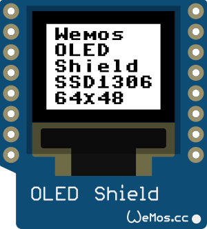
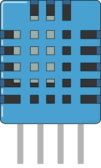

# MicroWeatherThing

This script is used on the Wemos D1 mini running MicroPython port for the ESP8266.

It connects to OpenWeatherMap API in order to get the current weather from a location and it shows the local Temperature and Humidity read from the DHT11 sensor.

What we need to do is download all the code from the `Relase` folder and rename the `MicroWeatherThing.py` file to `main.py` so it will be executed after booting up.

## Parts needed:

  * **ESP8266**

  I'm using the Wemos D1 Mini board.

  

  
  

  * **OLED display (I2C)**

  

  
  

  * **DHT11 Humidity sensor.**

  

  
  

### TO DO:

- [ ] Add delay between execution for the DHT11 sensor and the calls done to the OpenWeatherMap API.

- [ ] Better documentation.

- [ ] Add images.
    <ul><li> - [ ] Execution images.</li>
    <li> - [ ] Board setup images.</li></ul>
