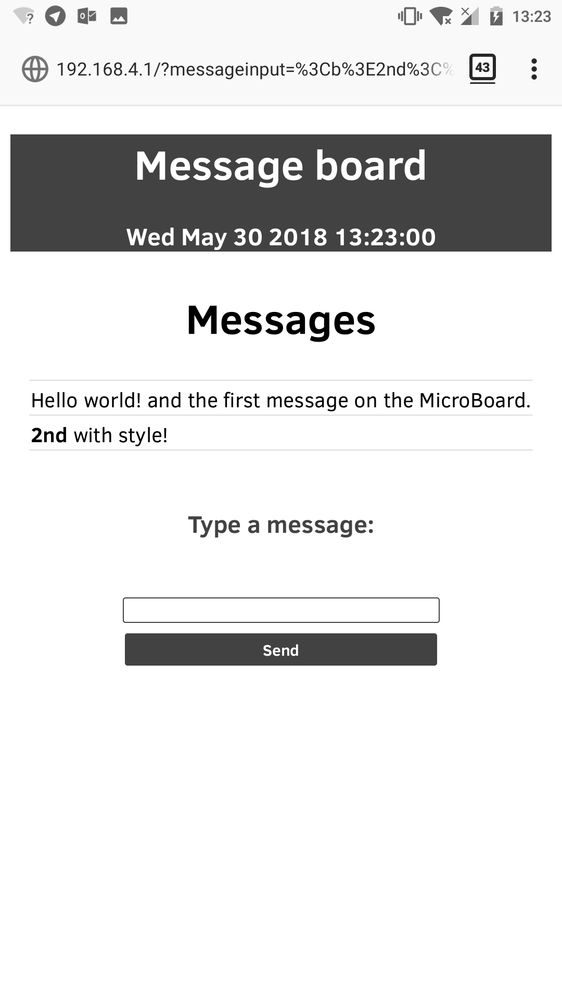
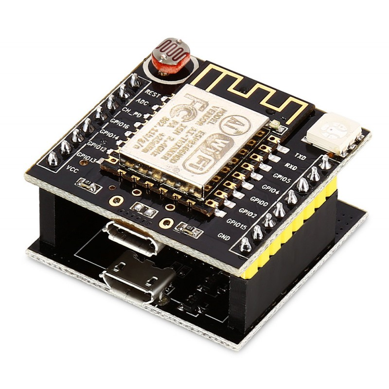

# MicroBoard

The idea of this script is to host a bulleting board on a webserver based on the ESP8266 where it will read the messages stored on a file called `messages.txt` from within the ESP8266 . This will create an access point to where you can connect and read the messages and post messages on it.

What we need to do is download all the code from the `Release` folder and rename the `MicroBoard.py` file to `main.py` so it will be executed after booting up.

### Image of code running on the witty cloud board:

## Parts needed:

  * ESP8266

  I'm using the Witty Cloud (ESP8266 based) board

  

  
  

## TO DO:

- [ ] Add real execution image / video.
    <ul><li> - [x] Execution image</li>
    <li> - [ ] Execution video.</li></ul>

- [ ] Better documentation.
