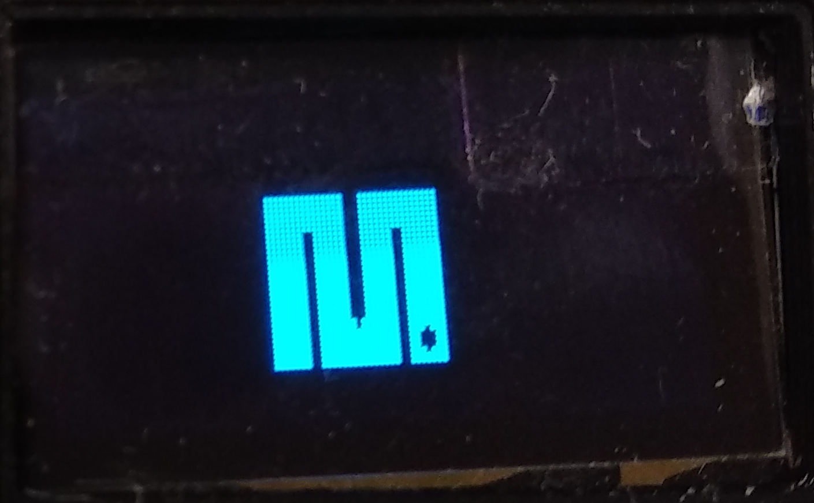

# MicroScriptConsole

This converts your ESP8266 board into a console where you can execute all script on the board. It will look all the `.py` files on the filesystem except for the `boot.py`, `main.py` and the `console.py`.

Everything is based on the `console.py` which is a wrapper for the `ssd1306` module for the display and a `keypad` class for the button so we can navigate on the system and use the buttons to operate the **"MicroScriptConsole"**.

What we need to do is download all the code from the **`Release`** folder so it will be executed after booting up.

**UPDATE:**

- [**2018-10-26**]

  I have finally generated the firmware for the ESP8266, so if you get the firmware flash onto the board and then get the all the code from the **`Release`** folder (Except for the `console.py`) and then name the `menu.py` to `main.py` so it will be executed after booting up.

  I have also added the `wifi_scanner.py` as a new script :smiley: !

  To get the firmware go to the [firmware](firmware) folder and get the latest built.

- [**2018-10-30**]

  I have ported the Conway's Game of Life from [Mike Causer](https://github.com/mcauser) to work with the `SSD1306` Oled display.

  With the new [firmware](firmware) created it really works better than I expected, it saves more memory and I can run the script with ease. I will add more functionalities to the script to manage WiFi so everything is located within the same script.

## Parts needed:

- **ESP8266**

I'm using the Wemos D1 Mini board.

  

  
  

- **OLED display (I2C)**

  

  
  

- **Push buttons**

  

  
  
  
  

---

# Scripts ported / added:

## **`show_images.py`**

Script to show images on the screen, these images are converted into hexadecimal text with an application which is called [The Dot Factory application](http://www.eran.io/the-dot-factory-an-lcd-font-and-image-generator/) and the process on how to make it from a `.png` file is quite straight forward.

Simply convert the `.png` image into `.bmp` extension with the software you prefer and then use the application to convert the `.bmp` into text.

You can also find the software on the `other_tools` folder, click [here](other_tools/) to go the folder.

Link to documented code

[Link to documented code](code/scripts/show_images.py)

#### **Execution images**

  

  
  
  

  
  

## **`rubber_duck_debugging.py`**

This is an implementation of the MicroProblemSolver script described [here](https://github.com/yeyeto2788/MicroPythonScripts/tree/master/MicroProblemSolver).

## **`simple_test.py`**

This is just a simple script that prints a text and the count of the button presses on the screen.

[Link to documented code](code/scripts/simple_test.py)

#### **Execution images**

  

  
  

## **`magic8_ball.py`**

Seeking for an advice to make a decision? This script is based on the [Magic 8-Ball](https://en.wikipedia.org/wiki/Magic_8-Ball) toy which was used for "fortune-telling"

[Link to documented code](code/scripts/magic8_ball.py)

## **`I2C_scanner.py`**

This script will scan all connected devices on the board to the I2C bus retrieving the HEX address and the decimal.

Take into account that if the OLED screen is connected this will also show the address of it, normally the address is `0x3D`.

[Link to documented code](code/scripts/I2C_scanner.py)

## **`wifi_scanner.py`**

This script will scan all available WiFi networks on the area and it will output the `strength`, `chanel`, `name`, and `authmode` of them

[Link to documented code](code/scripts/wifi_scanner.py)

## **`conways_game_of_life.py`**

This script is a zero-player game which emulates the cellular life creation.

The script was taken from the repository of [Mike Causer](https://github.com/mcauser/MicroPython-ESP8266-Nokia-5110-Conways-Game-of-Life)

More [info](https://en.wikipedia.org/wiki/Conway%27s_Game_of_Life)

[Link to documented code](code/scripts/conways_game_of_life.py)

---

## Useful links:

[Micropython forum](https://forum.micropython.org/viewtopic.php?f=16&t=4901&p=28154&hilit=oled+display#p28154)
[The Dot Factory application](http://www.eran.io/the-dot-factory-an-lcd-font-and-image-generator/)

---

## TO DO:

- [ ] Add all real execution images.

- [ ] Add all real execution videos.

- [ ] Port code to ESP32 (If needed).

- [x] Try to generate firmware with `console.py` module as frozen module.

- [ ] Add documentation for `console.py` module.

- [ ] **Scripts to be added:**
  <ul><li> - [ ] Bitcoin price tracker.</li>
  <li> - [ ] NeoPixels example.</li>
  <li> - [ ] DHT mqtt publisher.</li>
  <li> - [x] WiFi Scanner.</li>
  <li> - [ ] Analog Input reader.</li>
  <li> - [ ] PWM and/or Servo controller.</li>
  <li> - [ ] Stepper controlled [uln2003](https://github.com/yeyeto2788/MicroPythonScripts/tree/master/HelpScripts/Modules/uln2003).</li></ul>

- [ ] **Tools to be added:**
  <ul><li> - [ ] Board Code uploader.</li>
  <li> - [ ] Zip folder creation tool for all code within `Releases`.</li></ul>

## Special thanks to:

- [Radomir Dopieralski](https://github.com/deshipu) for the reply on the [MicroPython Forum](https://forum.micropython.org/viewtopic.php?f=16&t=5119)
- [Mike Causer](https://github.com/mcauser) for letting me port the Conway's Game of Life [script](https://github.com/mcauser/MicroPython-ESP8266-Nokia-5110-Conways-Game-of-Life)
