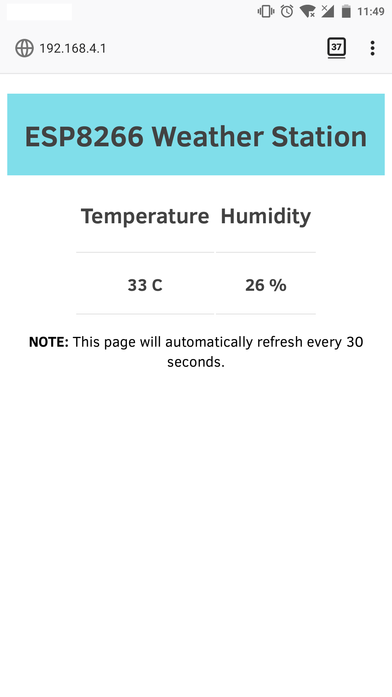

# MicroWeatherStation

This script will read the sensor DHT11 data and it will create a simple server so the data is shown on a web page.

### Image of code running on the Wemos D1 mini board:

## Parts needed:

  * ESP8266

  I'm using the Wemos D1 Mini board.

  

  
  

  * DHT11 Sensor

  

  
  

## NOTE:

Take into account that I'm using a Wemos D1 mini and it's DHT11 shield, so in the script you'll see the **`d = dht.DHT11(machine.Pin(2))`** and in the example page of the Micropython documentation they use other pin (4).

### TO DO:

- [ ] Better documentation.

- [x] Add execution images.
